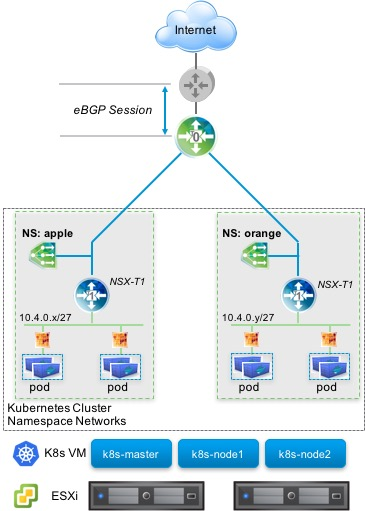
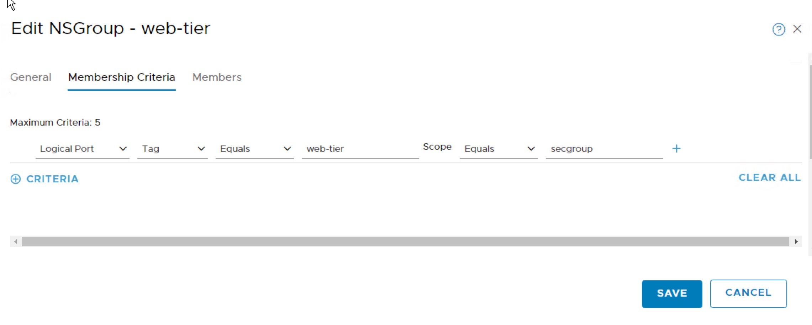
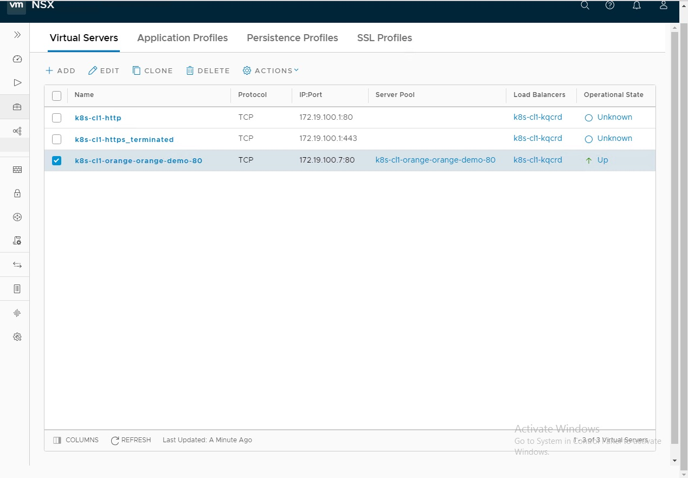
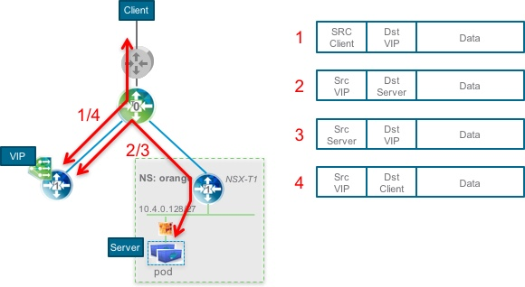
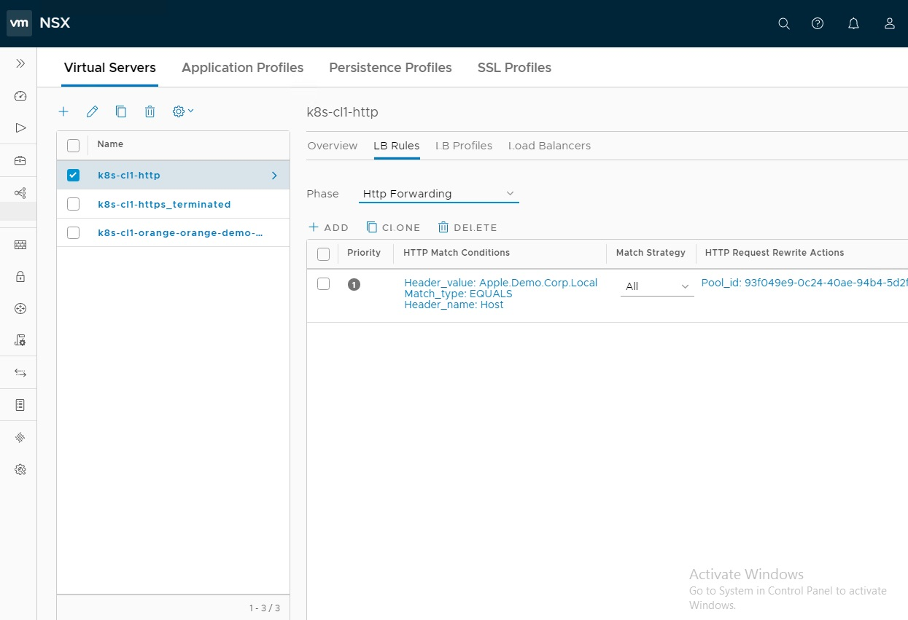
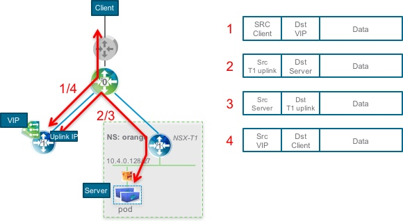
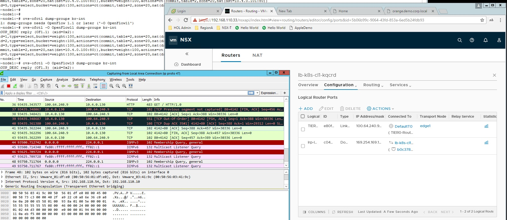
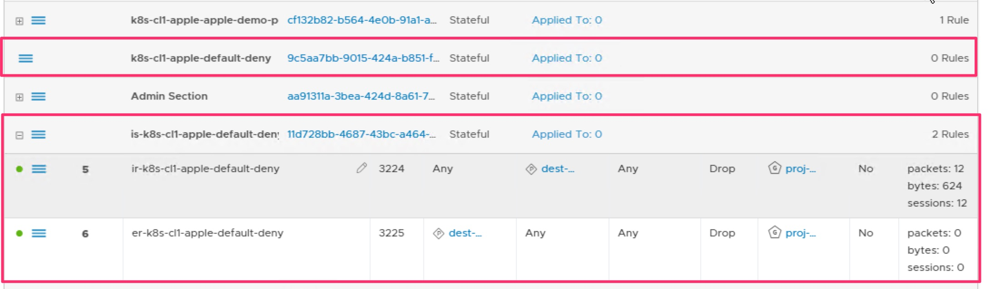
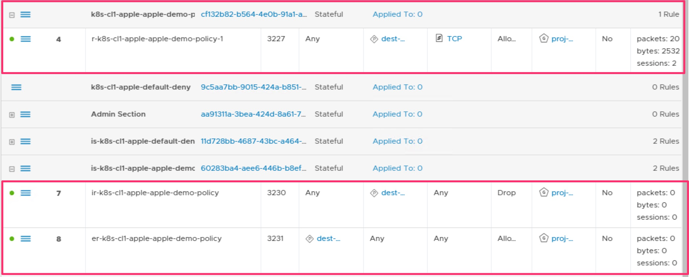
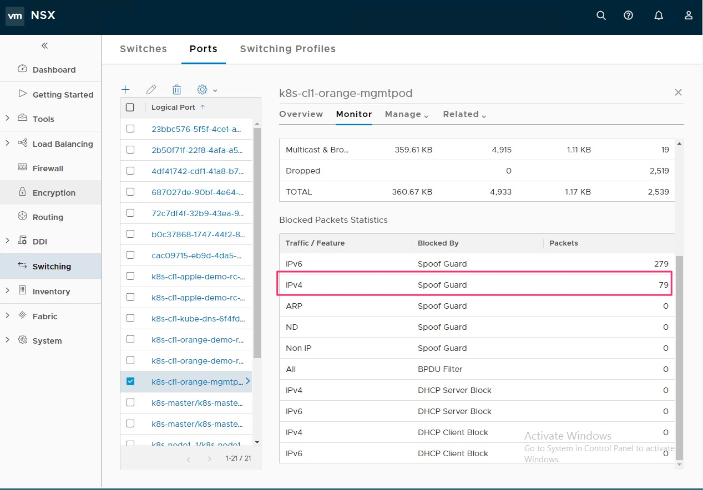

# Overview 
## Environment
  - vAPP
    NSBU-2018-01-NSX-T-DGO-K8S-v1.1
  - NSX-T  2.1

## Topology



## Create Namespace 'apple'
  - `kubectl create namespace apple`

## Change default namespace to 'apple'
  - `kubectl config set-context kubernetes-admin@kubernetes --namespace apple`
  - `kubectl config use-context kubernetes-admin@kubernetes`

## Create Pod
  - `kubectl create -f apple/pod-management.yaml`
  - `kubectl get pod -o wide`
  - `kubectl describe pod mgmtpod`

## Create Replication controller
  - `kubectl create -f  apple/apple-demo-replicationcontroller.yaml`
  - `kuebctl get pod -o wide`
  - Check counters of CIF in GUI
  - Check Pod name and replace it with the following example
  - `kubectl exec -it apple-demo-rc-krj5p -- ip address`
  - `kubectl exec -it apple-demo-rc-krj5p -- ping -c 3 10.4.0.131`

## Scale pod from 2 to 4
  - `kubectl scale --replicas=4 rs apple-demo-rc`
  - `kubectl get pod -o wide`
 
## Create service
  - `kubectl create -f apple/apple-demo-service.yaml`
  - `kubectl get svc`
  - `kubectl describe svc apple-demo`
  - Login to the slave node
  - `sudo ovs-ofctl dump-groups -O OpenFlow13 br-int`

## Create Ingress
  - `kubectl create -f apple/apple-demo-ingress.yaml`
  - `kubectl get ingress`
  - `kubectl describe ingress apple-demo-ingress`
  - Try to access to 'apple.demo.corp.local'
  - See LB configuration in GUI

## Create service with “type: Loadbalancer”
  - `kubectl create ns orange`
  - `kubectl -n orange create -f orange/orange-demo-replicationcontroller.yaml`
  - `kubectl -n orange create -f orange/orange-demo-service-lb.yaml`
  - `kubectl -n orange get svc`
  - `kubectl -n orange describe svc orange-demo`
  - See LB configuration in GUI
  - Try to access to assigned external IP

##  Security: Label based rules
  - `kubectl get pod -o wide`
  - `kubectl describe pod orange-demo-xxxxxx`
  - Create NSGroup in GUI
  - Create Firewall based on the created NSGroup
    i.e.) Block anything between pods and try ping between them

## Security: Kubernetes Network policies
  - `kubectl create -f apple/default-net-policy.yaml`
  - `kubectl get networkpolicy`
  - `kubectl describe networkpolicy default-deny`
  - See Firewall in GUI( sometimes reflesh on browse is needed)
  - Try to access to 'apple.demo.corp.local'
  - `kubectl create -f apple/apple-demo-network-policy.yaml`
  - `kubectl get networkpolicy`
  - `kubectl describe networkpolicy apple-demo-policy` 
  - See Firewall in GUI( sometimes reflesh on browse is needed)
  - Try to access to 'apple.demo.corp.local'

##  Spoof guard
  - `kubectl -n orange exec -it orange-mgmtpod -- /bin/bash`
  - `ip add`
  - `ip add delete x.x.x.x/x dev eth0`
  - `ip add add x.x.x.x/x dev eth0`
  - `ping x.x.x.x`
  - Check counters of CIF in GUI


# Detail 
## Create namespace 
  - Create T1 router without edgecluster specified
  - Connect T1 router to T0
  - Route is advertised to T0

```sh
localadmin@k8s-master:/var/lib$ kubectl create ns apple
namespace "apple" created

localadmin@k8s-master:/var/lib$ kubectl get ns apple
NAME      STATUS    AGE
apple     Active    7s

localadmin@k8s-master:/var/lib$ kubectl describe ns apple
Name:         apple
Labels:       <none>
Annotations:  <none>
Status:       Active

No resource quota.

No resource limits.
```

## Change default ns to apple

```sh
kubectl config set-context kubernetes-admin@kubernetes --namespace apple
kubectl config use-context kubernetes-admin@kubernetes
```

## Create pod
  - Create CIF, you can see CIF on GUI
  - See Stats
  - See Port Tracking

```yaml
# apple/pod-management.yaml
apiVersion: v1
kind: Pod
metadata:
  name: mgmtpod
spec:
  containers:
  - name: ubuntu
    image: tutum/ubuntu:trusty
    imagePullPolicy: IfNotPresent
    ports:
    - name: ssh
      containerPort: 22
    env:
    - name: ROOT_PASS
      value: VMware1!
```

```sh
localadmin@k8s-master:~/demos$ kubectl create -f apple/pod-management.yaml
pod "mgmtpod" created
localadmin@k8s-master:~/demos$
localadmin@k8s-master:~/demos$ kubectl get pod -o wide
NAME      READY     STATUS    RESTARTS   AGE       IP           NODE
mgmtpod   1/1       Running   0          31s       10.4.0.130   k8s-node1
localadmin@k8s-master:~/demos$
localadmin@k8s-master:~/demos$ kubectl describe pod
Name:         mgmtpod
Namespace:    apple
Node:         k8s-node1/10.0.1.11
Start Time:   Sun, 04 Feb 2018 20:47:14 -0800
Labels:       <none>
Annotations:  <none>
Status:       Running
IP:           10.4.0.130
Containers:
  ubuntu:
    Container ID:   docker://2f1bd320e9e1b11ddcd0b9ef9a481857f841654cf6405f0478c56a1e9e3ffa2d
    Image:          tutum/ubuntu:trusty
    Image ID:       docker-pullable://tutum/ubuntu@sha256:902adeca3e844fecc2576ca0e0bb5b2d3b310db9634aed2126b8622efa3477ab
    Port:           22/TCP
    State:          Running
      Started:      Sun, 04 Feb 2018 20:47:22 -0800
    Ready:          True
    Restart Count:  0
    Environment:
      ROOT_PASS:  VMware1!
    Mounts:
      /var/run/secrets/kubernetes.io/serviceaccount from default-token-64gbx (ro)
Conditions:
  Type           Status
  Initialized    True
  Ready          True
  PodScheduled   True
Volumes:
  default-token-64gbx:
    Type:        Secret (a volume populated by a Secret)
    SecretName:  default-token-64gbx
    Optional:    false
QoS Class:       BestEffort
Node-Selectors:  <none>
Tolerations:     node.kubernetes.io/not-ready:NoExecute for 300s
                 node.kubernetes.io/unreachable:NoExecute for 300s
Events:
  Type    Reason                 Age   From                Message
  ----    ------                 ----  ----                -------
  Normal  SuccessfulMountVolume  48s   kubelet, k8s-node1  MountVolume.SetUp succeeded for volume "default-token-64gbx"
  Normal  Scheduled              47s   default-scheduler   Successfully assigned mgmtpod to k8s-node1
  Normal  Pulled                 40s   kubelet, k8s-node1  Container image "tutum/ubuntu:trusty" already present on machine
  Normal  Created                40s   kubelet, k8s-node1  Created container
  Normal  Started                40s   kubelet, k8s-node1  Started container

```

## Create Replication Controller
  - nsx-demo images will be pulled and launch 2 pods
  - you can change the number of replicas
  - If you want to do label based firewall, uncomment secgroup. The label will be put into VIF as tag.
  - You can delete one of the pods and see how replication controller works.

```yaml
# apple/apple-demo-replicationcontroller.yaml
apiVersion: v1
kind: ReplicationController
metadata:
  name: apple-demo-rc
  labels:
    app: apple-demo
    # secgroup: web-tier
spec:
  replicas: 2
  template:
    metadata:
      labels:
        app: apple-demo
    spec:
      containers:
      - name: apple-demo
        image: yfauser/nsx-demo
        imagePullPolicy: IfNotPresent
        ports:
        - containerPort: 80

```

```sh
localadmin@k8s-master:~/demos$ kubectl get rc -o wide
NAME            DESIRED   CURRENT   READY     AGE       CONTAINERS   IMAGES             SELECTOR
apple-demo-rc   2         2         2         1h        apple-demo   yfauser/nsx-demo   app=apple-demo

localadmin@k8s-master:~/demos$ kubectl describe rc apple-demo-rc
Name:         apple-demo-rc
Namespace:    apple
Selector:     app=apple-demo
Labels:       app=apple-demo
Annotations:  <none>
Replicas:     2 current / 2 desired
Pods Status:  2 Running / 0 Waiting / 0 Succeeded / 0 Failed
Pod Template:
  Labels:  app=apple-demo
  Containers:
   apple-demo:
    Image:        yfauser/nsx-demo
    Port:         80/TCP
    Environment:  <none>
    Mounts:       <none>
  Volumes:        <none>
Events:           <none>

```

 - create NSgroup based on K8s label



## Create service
  - Create service which will assign culster ips for pods
  - This will be configured on openvswitch in K8s nodes.

```yaml
# apple/apple-demo-service.yaml
apiVersion: v1
kind: Service
metadata:
  name: apple-demo
  labels:
    app: apple-demo
spec:
  ports:
    # the port that this service should serve on
    - port: 80
      targetPort: 80
      protocol: TCP
      name: tcp
  selector:
    app: apple-demo
```

```sh
localadmin@k8s-master:~/demos$ kubectl create -f apple/apple-demo-service.yaml
service "apple-demo" created
localadmin@k8s-master:~/demos$ kubectl get svc -o wide
NAME         TYPE        CLUSTER-IP     EXTERNAL-IP   PORT(S)   AGE       SELECTOR
apple-demo   ClusterIP   10.111.79.84   <none>        80/TCP    8s        app=apple-demo
localadmin@k8s-master:~/demos$ kubectl describe svc
Name:              apple-demo
Namespace:         apple
Labels:            app=apple-demo
Annotations:       <none>
Selector:          app=apple-demo
Type:              ClusterIP
IP:                10.111.79.84
Port:              tcp  80/TCP
TargetPort:        80/TCP
Endpoints:         10.4.0.130:80,10.4.0.131:80
Session Affinity:  None
Events:            <none>
```

```sh
localadmin@k8s-node1:~$ sudo ovs-ofctl dump-groups -O OpenFlow13 br-int
OFPST_GROUP_DESC reply (OF1.3) (xid=0x2):
 group_id=2,type=select,bucket=weight:100,actions=ct(commit,table=2,zone=20,nat(dst=10.4.0.34:53))
 group_id=4,type=select,bucket=weight:100,actions=ct(commit,table=2,zone=20,nat(dst=10.4.0.131:80)),bucket=weight:100,actions=ct(commit,table=2,zone=20,nat(dst=10.4.0.130:80))
 group_id=5,type=select,bucket=weight:100,actions=ct(commit,table=2,zone=20,nat(dst=10.4.0.34:53))
 group_id=1,type=select,bucket=weight:100,actions=ct(commit,table=2,zone=20,nat(dst=10.0.1.10:6443))
```



## Create Service with 'Type Load balancer'
  - Create service with 'type loadbalancer'
  - Configure load balance config on openvswitch and L4 loadbalancer in nsx as well
  - Source IP is natted with VIP

```yaml
# orange/orange-demo-service-lb.yaml
apiVersion: v1
kind: Service
metadata:
  name: orange-demo
  labels:
    app: orange-demo
spec:
  ports:
    # the port that this service should serve on
    - port: 80
      targetPort: 80
      protocol: TCP
      name: tcp
  selector:
    app: orange-demo
  type: LoadBalancer
```

```sh
localadmin@k8s-master:~/demos$ kubectl -n orange describe svc orange-demo                Name:                     orange-demo
Namespace:                orange
Labels:                   app=orange-demo
Annotations:              <none>
Selector:                 app=orange-demo
Type:                     LoadBalancer
IP:                       10.99.125.110
LoadBalancer Ingress:     172.19.100.7
Port:                     tcp  80/TCP
TargetPort:               80/TCP
NodePort:                 tcp  30426/TCP
Endpoints:                10.4.0.98:80,10.4.0.99:80
Session Affinity:         None
External Traffic Policy:  Cluster
Events:                   <none>
```



## Create ingress
  - create ingress
  - NSX L7 load balancer will be configured
  - Source IP address is natted with T1 uplink

```yaml
# apple/apple-demo-ingress.yaml
apiVersion: extensions/v1beta1
kind: Ingress
metadata:
  name: apple-demo-ingress
spec:
  rules:
  - host: apple.demo.corp.local
    http:
      paths:
      - backend:
          serviceName: apple-demo
          servicePort: 80
```

```sh
localadmin@k8s-master:~/demos$ kubectl get ingress -o wide
NAME                 HOSTS                   ADDRESS        PORTS     AGE
apple-demo-ingress   apple.demo.corp.local   172.19.100.1   80        3h
localadmin@k8s-master:~/demos$
localadmin@k8s-master:~/demos$
localadmin@k8s-master:~/demos$ kubectl describe ingress apple-demo-ingress
Name:             apple-demo-ingress
Namespace:        apple
Address:          172.19.100.1
Default backend:  default-http-backend:80 (<none>)
Rules:
  Host                   Path  Backends
  ----                   ----  --------
  apple.demo.corp.local
                            apple-demo:80 (<none>)
Annotations:
Events:  <none>

```







## Network policy
  - This is GA in k8s 1.7
  - You can create multiple policies for a pod
  - Default is 
    - Ingress to Pods is DENY
    - Egress from Pods is ALLOW
  - If you create network policy, two sections will be created in FW

### Create Default deny policy
  - If you create network policy, two sections will be created in FW
  - top section has no rule
  - bottom section has two rules which is
    - ANY to PODS deny
    - PODS to ANY deny

```yaml
# apple/default-net-policy.yaml
apiVersion: networking.k8s.io/v1
kind: NetworkPolicy
metadata:
  name: default-deny
spec:
  podSelector: {}
  policyTypes:
  - Ingress
  - Egress
```

```sh
localadmin@k8s-master:~/demos$ kubectl create -f  apple/default-net-policy.yaml
networkpolicy "default-deny" created
lo
localadmin@k8s-master:~/demos$ kubectl get networkpolicy
NAME                POD-SELECTOR     AGE
apple-demo-policy   app=apple-demo   21h
default-deny        <none>           21h
localadmin@k8s-master:~/demos$ kubectl describe networkpolicy default-deny
Name:         default-deny
Namespace:    apple
Created on:   2018-02-04 21:59:27 -0800 PST
Labels:       <none>
Annotations:  <none>
Spec:
  PodSelector:     <none> (Allowing the specific traffic to all pods in this namespace)
  Allowing ingress traffic:
    <none> (Selected pods are isolated for ingress connectivity)
  Allowing egress traffic:
    <none> (Selected pods are isolated for egress connectivity)
  Policy Types: Ingress, Egress
l
```



### Create policy which allows incoming http traffic
  - If you create network policy, two sections will be created in FW
  - top section has the rule allows http
  - bottom section has two rules which is
    - ANY to PODS deny
    - PODS to ANY deny

```yaml
# apple/apple-demo-network-policy.yaml
apiVersion: networking.k8s.io/v1
kind: NetworkPolicy
metadata:
  name: apple-demo-policy
spec:
  podSelector:
    matchLabels:
      app: apple-demo
  ingress:
    - ports:
        - protocol: TCP
          port: 80

```

```sh
localadmin@k8s-master:~/demos$ kubectl create -f  apple/apple-demo-network-policy.yaml
networkpolicy "apple-demo-policy" created
localadmin@k8s-master:~/demos$ kubectl get networkpolicy
NAME                POD-SELECTOR     AGE
apple-demo-policy   app=apple-demo   6s
default-deny        <none>           21h
localadmin@k8s-master:~/demos$ kubectl describe networkpolicy apple-demo-policy
Name:         apple-demo-policy
Namespace:    apple
Created on:   2018-02-05 19:52:17 -0800 PST
Labels:       <none>
Annotations:  <none>
Spec:
  PodSelector:     app=apple-demo
  Allowing ingress traffic:
    To Port: 80/TCP
    From: <any> (traffic not restricted by source)
  Allowing egress traffic:
    <none> (Selected pods are isolated for egress connectivity)
  Policy Types: Ingress
localadmin@k8s-master:~/demos$

```



## Security: Spoofguard
  - Create pod with 'security context'
  - This will enforce spoofguard on CIF

```yaml
# orange/pod-management.yaml
apiVersion: v1
kind: Pod
metadata:
  name: orange-mgmtpod
spec:
  containers:
  - name: ubuntu
    image: tutum/ubuntu:trusty
    imagePullPolicy: IfNotPresent
    ports:
    - name: ssh
      containerPort: 22
    env:
    - name: ROOT_PASS
      value: VMware1!
    securityContext:
      privileged: true
```

```sh
localadmin@k8s-master:~/demos/orange$ kubectl -n orange get pod -o wide
NAME                   READY     STATUS    RESTARTS   AGE       IP           NODE
orange-demo-rc-dgdtl   1/1       Running   1          5d        10.4.0.102   k8s-node2
orange-demo-rc-dkq6v   1/1       Running   1          5d        10.4.0.101   k8s-node1
orange-mgmtpod         1/1       Running   1          11d       10.4.0.100   k8s-node1
localadmin@k8s-master:~/demos/orange$
localadmin@k8s-master:~/demos/orange$ kubectl -n orange exec -it orange-mgmtpod -- /bin/bash
root@orange-mgmtpod:/#
root@orange-mgmtpod:/# ip add
1: lo: <LOOPBACK,UP,LOWER_UP> mtu 65536 qdisc noqueue state UNKNOWN group default qlen 1
    link/loopback 00:00:00:00:00:00 brd 00:00:00:00:00:00
    inet 127.0.0.1/8 scope host lo
       valid_lft forever preferred_lft forever
    inet6 ::1/128 scope host
       valid_lft forever preferred_lft forever
10: eth0@if11: <BROADCAST,MULTICAST,UP,LOWER_UP> mtu 1500 qdisc noqueue state UP group default qlen 1000
    link/ether 02:50:56:00:40:03 brd ff:ff:ff:ff:ff:ff
    inet 10.4.0.100/27 scope global eth0
       valid_lft forever preferred_lft forever
    inet6 fe80::50:56ff:fe00:4003/64 scope link
       valid_lft forever preferred_lft forever

root@orange-mgmtpod:/#
root@orange-mgmtpod:/# ping -c 3 10.4.0.101
PING 10.4.0.101 (10.4.0.101) 56(84) bytes of data.
64 bytes from 10.4.0.101: icmp_seq=1 ttl=64 time=2.05 ms
64 bytes from 10.4.0.101: icmp_seq=2 ttl=64 time=1.39 ms
64 bytes from 10.4.0.101: icmp_seq=3 ttl=64 time=0.628 ms

--- 10.4.0.101 ping statistics ---
3 packets transmitted, 3 received, 0% packet loss, time 2005ms
rtt min/avg/max/mdev = 0.628/1.359/2.051/0.582 ms
root@orange-mgmtpod:/#
root@orange-mgmtpod:/# ip add delete 10.4.0.100/27 dev eth0
root@orange-mgmtpod:/# ip add add 10.4.0.103/27 dev eth0
root@orange-mgmtpod:/# ping 10.4.0.101
PING 10.4.0.101 (10.4.0.101) 56(84) bytes of data.

```



# Link
 - https://confluence.eng.vmware.com/display/UJO/DK+GA+Deployment+with+Kubeadm
 - https://confluence.eng.vmware.com/display/UJO/How-to+articles
 - https://www.evernote.com/l/Af9NcMC3NalHO40nLCpbDGJrlMQVJ2y4T1I
 - https://kubernetes.io/docs/reference/kubectl/cheatsheet/