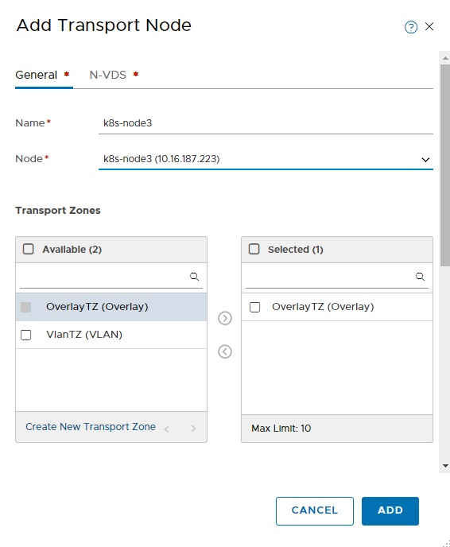

# Setup instruction for BMC worker node


## Basic host configuration(Hostname, Timezone, Network)

```
# hostnamectl set-hostname k8s-node1
# timedatectl set-timezone Asia/Tokyo

# systemctl diable NetworkManager
# systemctl stop NetworkManager

# cat <<EOF > /etc/sysconfig/network-scripts/ifcfg-ens192
TYPE=Ethernet
BOOTPROTO=static
IPV6INIT=no
NAME=ens192
DEVICE=ens192
ONBOOT=yes
IPADDR=10.16.187.221
NETMASK=255.255.255.0
EOF

# cat <<EOF > /etc/sysconfig/network-scripts/ifcfg-ens224
TYPE=Ethernet
BOOTPROTO=static
IPV6INIT=no
NAME=ens224
DEVICE=ens224
ONBOOT=yes
IPADDR=192.168.80.121
NETMASK=255.255.255.192
DNS1="10.127.1.131"
DOMAIN=ytsuboi.local
GATEWAY=192.168.80.1
EOF

# systemctl restart network
```

## Configure Subscription 

```
# subscription-manager register --username=<username> --password=<password>
# subscription-manager attach --pool=<poolid>
# subscription-manager repos --disable="*"
# subscription-manager repos --enable="rhel-7-server-rpms" --enable="rhel-7-server-extras-rpms"
```

## Update packages except for kernel and redhat releases
Add the following lines in /etc/yum.conf
```
exclude=kernel* redhat-release*
```


```
# yum -y update
```

## Install necessary packeges to configure as transport node

```
# yum -y groupinstall "Virtualization Hypervisor" "Virtualization Client"  "Virtualization Platform" "Virtualization Tools"
# yum install -y PyYAML c-ares libev libunwind libyaml python-beaker python-gevent python-greenlet python-mako python-markupsafe python-netaddr python-paste python-tempita at bc cups-client ed m4 mailx patch redhat-lsb-core redhat-lsb-submod-security spax tcpdump time
# yum install -y wget
```

Reboot before configuring

``` 
# reboot
```

## Register node to NSX-T and conigure as transport node in UI

Add and concigure the node like below





Add the following tag Transport Node 
- `{'ncp/cluster': <clustername>}`
- `{'ncp/node_name': <node_name>}`


## Preparation for kubeadm
### Open some ports on Firewall On worker
```
firewall-cmd --zone=public --add-port=10250/tcp --permanent
firewall-cmd --zone=public --add-port=10255/tcp --permanent
firewall-cmd --reload
```

### Install Docker

```
yum install -y docker
systemctl enable docker && systemctl start docker
```


### Install kubeadm

```
cat <<EOF > /etc/yum.repos.d/kubernetes.repo
[kubernetes]
name=Kubernetes
baseurl=https://packages.cloud.google.com/yum/repos/kubernetes-el7-x86_64
enabled=1
gpgcheck=1
repo_gpgcheck=1
gpgkey=https://packages.cloud.google.com/yum/doc/yum-key.gpg https://packages.cloud.google.com/yum/doc/rpm-package-key.gpg
EOF
```

Turn off SELINUX

```
# setenforce 0
# cat /etc/selinux/config

# This file controls the state of SELinux on the system.
# SELINUX= can take one of these three values:
#     enforcing - SELinux security policy is enforced.
#     permissive - SELinux prints warnings instead of enforcing.
#     disabled - No SELinux policy is loaded.
SELINUX=permissive
# SELINUXTYPE= can take one of three two values:
#     targeted - Targeted processes are protected,
#     minimum - Modification of targeted policy. Only selected processes are protected.
#     mls - Multi Level Security protection.
SELINUXTYPE=targeted
```

Enable forwarding in the node. (Not sure if we can remove this config after joining)

```text
cat <<EOF >  /etc/sysctl.d/k8s.conf
net.ipv4.ip_forward = 1
net.bridge.bridge-nf-call-ip6tables = 1
net.bridge.bridge-nf-call-iptables = 1
EOF
sysctl --system

```

Turn off Swap

```
# swapoff -a
[root@k8s-master1 ~]#
[root@k8s-master1 ~]# vi /etc/fstab
[root@k8s-master1 ~]#
[root@k8s-master1 ~]#
[root@k8s-master1 ~]# cat /etc/fstab

#
# /etc/fstab
# Created by anaconda on Tue Oct  2 21:28:16 2018
#
# Accessible filesystems, by reference, are maintained under '/dev/disk'
# See man pages fstab(5), findfs(8), mount(8) and/or blkid(8) for more info
#
/dev/mapper/rhel-root   /                       xfs     defaults        0 0
UUID=5ebbbb0d-9ac2-481e-9627-8a44659f82bd /boot                   xfs     defaults        0 0
#/dev/mapper/rhel-swap   swap                    swap    defaults        0 0
```

Install kubectl, kubeadm and kubelet

```text
# yum --showduplicates list kubelet  | grep 1.11
kubelet.x86_64                        1.11.0-0                        kubernetes
kubelet.x86_64                        1.11.1-0                        kubernetes
kubelet.x86_64                        1.11.2-0                        kubernetes
kubelet.x86_64                        1.11.3-0                        kubernetes

# KUBEVERSION=1.11.3-0; yum -y install kubeadm-${KUBEVERSION} kubelet-${KUBEVERSION} kubectl-${KUBEVERSION}
# systemctl enable kubelet && systemctl start kubelet
```

## Install CNI for NCP

Download nsx ncp package from vmware.com and place it on the node.
Install CNI package. Use the following options since it will conflict another package.

```
rpm -ivh -f --replacefiles ./nsx-cni-2.3.0.10066840-1.x86_64.rpm
```

Check cni files are created.

```
# ls -la /etc/cni/net.d/
total 8
drwxr-xr-x. 2 root root 49 Oct 10 11:05 .
drwxr-xr-x. 3 root root 19 Oct 10 11:05 ..
-rw-r--r--. 1 root root 72 Sep 14 07:09 10-nsx.conf
-rw-r--r--. 1 root root 54 Sep 14 07:09 99-loopback.conf
```

## Deploy ncp and nsx-node-agent
### Create namspace for ncp
```
kubectl create ns nsx-system
```

### Setup RBAC for ncp service account

```
kubectl apply ncp-rbac.yaml
```

### Create secret used for NSX API client in NCP
Please see README.md on upper folder about how to generate cert files

```
kubectl -n nsx-system create secret tls ncp-client-cert --cert=./ncp-nsx-t-superuser.crt --key=./ncp-nsx-t-superuser.key
kubectl -n nsx-system create secret generic nsx-cert --from-file=./nsx.crt
```
### Apply ncp configuration

The diff from VM is below
- `node_type = BAREMETAL` in `[coe]`

```
kubectl apply -f nsx-ncp-rsyslog-conf.yaml
kubectl apply -f ncp-rc.yml
```

### Apply nsx-node-agent configuration

The diff from VM is below
- `node_type = BAREMETAL` in `[coe]`
- `ovs_bridge = nsx-managed` in `[nsx_node_agent]`
- Uncomment out 
  ```
  - name: nestdb-sock
    mountPath: /var/run/vmware/nestdb/nestdb-server.sock
  ```
- Uncomment out 
  ```
  - name: nestdb-sock
    hostPath:
      path: /var/run/vmware/nestdb/nestdb-server.sock
      type: Socket
  ```
  
- Uncomment out
  ```
  - DAC_OVERRIDE
  ```

```
kubectl apply -f nsx-node-agent-rsyslog-conf.yaml
kubectl apply -f nsx-node-agent-ds.yml
```


